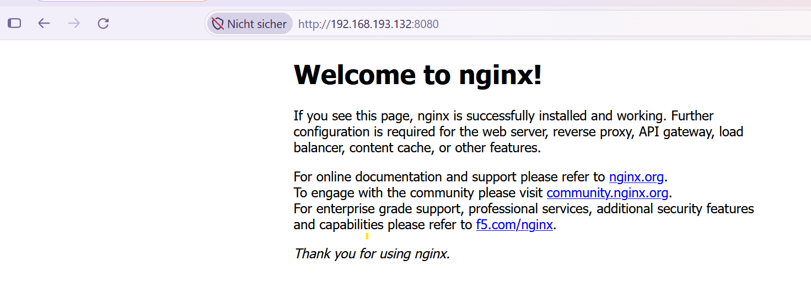
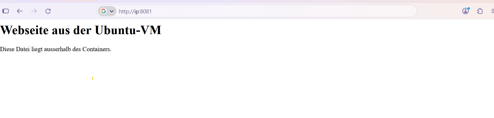
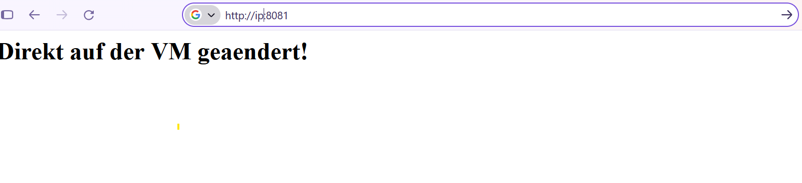

[Home](/) . [Technische Dokumentation](/#technische-dokumentation)

# Einleitung
Im folgenden wird  ein Nginx-Webserver als Docker-Container erstellt. Der Container wird gestartet und gestoppt und getestet ob er im Browser erreichbar ist.

# Nginx-Webserver

## webserver erstellen
```code
ptops@pt-lab01:/var/lib$ sudo docker run -d --name webserver -p 8080:80 nginx:stable
Unable to find image 'nginx:stable' locally
stable: Pulling from library/nginx
f1a6a629b824: Pull complete
ecc510c1e359: Pull complete
f4616bb1be1c: Pull complete
220a6ac36368: Pull complete
3d774efa34e3: Pull complete
cb44c3fe542b: Pull complete
121907e00c1c: Pull complete
32970ab31784: Download complete
50204dda2e59: Download complete
Digest: sha256:9bf97bd7714f5e24c1ccd545ecb9eb5435cb6d109c97cebb15e7e455e0239edb
Status: Downloaded newer image for nginx:stable
7a08b25f21dda869bd2178b43ee5554f911919f8d9041a9f2451e677b23a5d81
ptops@pt-lab01:/var/lib$
```

* run	Einen neuen Container erstellen und starten
* -d	Im Hintergrund laufen lassen
* --name webserver	Dem Container den Namen webserver geben
* -p 8080:80	Port 8080 der VM mit Port 80 des Containers verbinden
* nginx:stable	Image nginx mit dem Tag stable verwenden

## images auflisten

```code
ptops@pt-lab01:/var/lib$ sudo docker images
                                                                                                                                                              i Info →   U  In Use
IMAGE                ID             DISK USAGE   CONTENT SIZE   EXTRA
hello-world:latest   5e2309035332       25.9kB         9.49kB    U
nginx:stable         9bf97bd7714f        242MB         66.5MB    U
ptops@pt-lab01:/var/lib$
```

* Image	    --> nginx:stable	Vorlage mit Nginx und den benötigten Dateien
* Container -->	webserver	Eine aus diesem Image erzeugte Instanz


## Überpürfen ob Docker läuft

```code
ptops@pt-lab01:/var/lib$ sudo docker ps
CONTAINER ID   IMAGE          COMMAND                  CREATED         STATUS         PORTS                                     NAMES
7a08b25f21dd   nginx:stable   "/docker-entrypoint.…"   7 minutes ago   Up 7 minutes   0.0.0.0:8080->80/tcp, [::]:8080->80/tcp   webserver
ptops@pt-lab01:/var/lib$
```

## Webserver aufrufen



## webserver stoppen 

```code
ptops@pt-lab01:/var/lib$ sudo docker stop webserver
[sudo] Passwort für ptops:
webserver
ptops@pt-lab01:/var/lib$ sudo docker ps
CONTAINER ID   IMAGE     COMMAND   CREATED   STATUS    PORTS     NAMES
ptops@pt-lab01:/var/lib$
```
## Shell im Container öffnen

```code
ptops@pt-lab01:/var/lib$ sudo docker exec -it webserver sh

```
| Bestandteil | Bedeutung |
|---|---|
| `exec` | Einen Befehl im laufenden Container ausführen |
| `-it` | Eine interaktive Sitzung mit Terminal öffnen |
| `webserver` | Name des Containers |
| `sh` | Die Shell, die wir starten |

### Startseite anzeige
```code
# cat /usr/share/nginx/html/index.html
<!DOCTYPE html>
<html>
<head>
<title>Welcome to nginx!</title>
<style>
html { color-scheme: light dark; }
body { width: 35em; margin: 0 auto;
font-family: Tahoma, Verdana, Arial, sans-serif; }
</style>
</head>
<body>
<h1>Welcome to nginx!</h1>
<p>If you see this page, nginx is successfully installed and working.
Further configuration is required for the web server, reverse proxy,
API gateway, load balancer, content cache, or other features.</p>

<p>For online documentation and support please refer to
<a href="https://nginx.org/">nginx.org</a>.<br/>
To engage with the community please visit
<a href="https://community.nginx.org/">community.nginx.org</a>.<br/>
For enterprise grade support, professional services, additional
security features and capabilities please refer to
<a href="https://f5.com/nginx">f5.com/nginx</a>.</p>

<p><em>Thank you for using nginx.</em></p>
</body>
</html>
#
```

## Webseite außerhalb des Containers speichern – Bind Mount

Die Webseite wird in einem Ordner der Ubuntu-VM gespeichert und
in den Nginx-Container eingebunden. Änderungen an der Datei sind
direkt sichtbar. Die Datei bleibt auch beim Löschen des Containers erhalten.

### Datei außerhalb des Containers erstellen
```code
ptops@pt-lab01:~/docker-uebungen/webseite$ cat index.html
<h1>Webseite aus der Ubuntu-VM</h1>
<p>Diese Datei liegt ausserhalb des Containers.</p>
ptops@pt-lab01:~/docker-uebungen/webseite$
```
### Ein zweiten Webserver erstellen

```code
ptops@pt-lab01:~/docker-uebungen/webseite$ sudo docker run -d --name webserver2 -p 8081:80 --mount type=bind,source="$HOME/docker-uebungen/webseite",target=/usr/share/nginx/html,readonly  nginx:stable
```
| Bestandteil | Bedeutung |
|---|---|
| `type=bind` | Einen Ordner der VM einbinden |
| `source=…` | Ordner auf der Ubuntu-VM |
| `target=/usr/share/nginx/html` | Pfad, unter dem der Container den Ordner sieht |
| `readonly` | Der Container darf die Dateien lesen, aber nicht verändern |

### Webserver testen


### Änderung außerhalb des Container

```code
ptops@pt-lab01:~/docker-uebungen/webseite$ printf '<h1>Direkt auf der VM geaendert!</h1>\n' > ~/docker-uebungen/webseite/index.html
```


Die Änderung erscheint ohne Containerneustart, weil Nginx dieselbe eingebundene Datei liest.
Die Datei bleibt jetzt auch erhalten, wenn webserver2 gelöscht wird.

## Zusammenfassung

| Befehl | Beschreibung |
|---|---|
|`docker run -d --name webserver -p 8080:80 nginx:stable` | Erstellt einen Container "webserver" aus dem Image "nginx" |
| `docker images` | Zeigt alle lokalen Images |
| `docker ps` | Zeigt laufende Container |
| `docker ps -a` | Zeigt alle Container, auch gestoppte |
| `docker start webserver` | Startet den vorhandenen Container |
| `docker stop webserver` | Stoppt den Container |
| `docker logs --tail 20 webserver` | Zeigt die letzten 20 Zeile des Log zum Container "webserver" an |
| `docker exec -it webserver sh` | Shell im Container "webserver" öffne |


