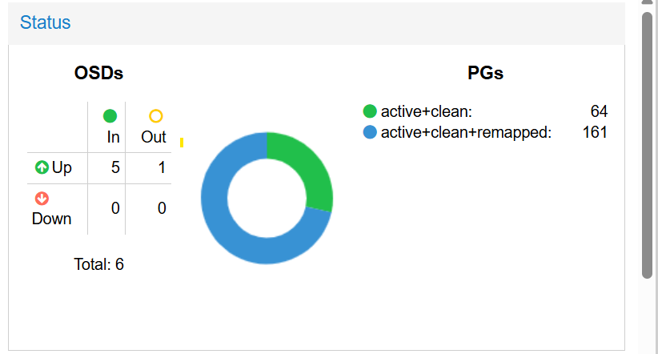
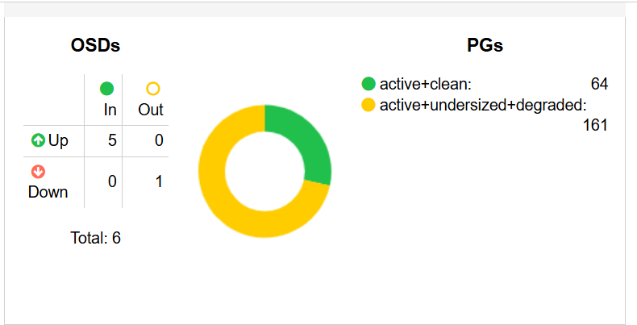

[Home](/) · [Technische Dokumentation](/#technische-dokumentation)

# Problem
Der Cluster meldet HEALTH_WARN, zeigt aber zunächst keinen klaren Grund.

```code
pve1:/root # ceph status
  cluster:
    id:     98c4f89d-3bd7-487f-8c3b-7483b5090f5e
    health: HEALTH_WARN
            3 OSD(s)
```


Mit folgendem Befehl gibt Ceph die Warnung genauer aus:

```code
pve1:/root # ceph health detail
HEALTH_WARN 3 OSD(s)
[WRN] BLUESTORE_FREE_FRAGMENTATION: 3 OSD(s)
     osd.0 0.825436
     osd.1 0.819154
     osd.2 0.817841

```
Steht dort BLUESTORE_FREE_FRAGMENTATION, ist der freie Speicherplatz auf einem oder mehreren OSDs stark fragmentiert. Das kann neue Schreibvorgänge ausbremsen. Eine einfache Defragmentierung wie unter Windows gibt es dafür nicht.
Welche OSDs betroffen sind, zeigt:

```code
pve1:/root # ceph tell osd.* bluestore allocator score block
osd.0: {
    "fragmentation_rating": 0.82522076449835025
}
osd.1: {
    "fragmentation_rating": 0.81925334676448447
}
osd.2: {
    "fragmentation_rating": 0.81800306414065038
}
osd.3: {
    "fragmentation_rating": 0.018168666465137814
}
osd.4: {
    "fragmentation_rating": 0.018560372496041505
}
osd.5: {
    "fragmentation_rating": 0.017182322032072681
}
MGWS-BSP_pve1:/root #
```

Je näher der Wert an 1, desto stärker die Fragmentierung.

# Lösung
Eine schnelle Defragmentierung gibt es nicht. Falls die Fragmentierung tatsächlich Probleme verursacht, können die betroffenen OSDs einzeln neu aufgebaut werden. Vor jedem OSD prüfen, ob der Cluster den Ausfall verkraftet; danach warten, bis wieder alle PGs active+clean sind.

> [!IMPORTANT]
> Immer nur **einen OSD gleichzeitig** neu aufbauen. Erst wenn alle PGs wieder `active+clean` sind, den nächsten OSD bearbeiten. Vorher freien Speicher und Redundanz prüfen.

## 1. Überprüfen ob osd auf out gesetzte werden kann

```code
pve1:/root # ceph osd ok-to-stop 0
{"ok_to_stop":true,"osds":[0],"num_ok_pgs":161,"num_not_ok_pgs":0,"ok_become_degraded":["1.0","3.0","3.1","3.2","3.3","3.4","3.5","3.6","3.7","3.8","3.9","3.a","3.b","3.c","3.d","3.e","3.f","3.10","3.11","3.12","3.13","3.14","3.15","3.16","3.17","3.18","3.19","3.1a","3.1b","3.1c","3.1d","3.1e","3.1f","4.0","4.1","4.2","4.3","4.4","4.5","4.6","4.7","4.8","4.9","4.a","4.b","4.c","4.d","4.e","4.f","4.10","4.11","4.12","4.13","4.14","4.15","4.16","4.17","4.18","4.19","4.1a","4.1b","4.1c","4.1d","4.1e","4.1f","4.20","4.21","4.22","4.23","4.24","4.25","4.26","4.27","4.28","4.29","4.2a","4.2b","4.2c","4.2d","4.2e","4.2f","4.30","4.31","4.32","4.33","4.34","4.35","4.36","4.37","4.38","4.39","4.3a","4.3b","4.3c","4.3d","4.3e","4.3f","4.40","4.41","4.42","4.43","4.44","4.45","4.46","4.47","4.48","4.49","4.4a","4.4b","4.4c","4.4d","4.4e","4.4f","4.50","4.51","4.52","4.53","4.54","4.55","4.56","4.57","4.58","4.59","4.5a","4.5b","4.5c","4.5d","4.5e","4.5f","4.60","4.61","4.62","4.63","4.64","4.65","4.66","4.67","4.68","4.69","4.6a","4.6b","4.6c","4.6d","4.6e","4.6f","4.70","4.71","4.72","4.73","4.74","4.75","4.76","4.77","4.78","4.79","4.7a","4.7b","4.7c","4.7d","4.7e","4.7f"]}
MGWS-BSP_pve1:/root #
```

## 2. osd auf out setzten

```code
pve1:/root # ceph osd out 0
marked out osd.0.
```




## 3. osd stoppen
```code
pve1:/root # pveceph stop --service osd.0
pve1:/root # ceph status
  cluster:
    id:     98c4f89d-3bd7-487f-8c3b-7483b5090f5e
    health: HEALTH_WARN
```
## 4. osd entfernen

pveceph osd destroy 0 --cleanup entfernt osd.0 aus Ceph und räumt seine Datenstrukturen auf der zugeordneten Platte /dev/sdb auf pve1 ab. --cleanup sorgt dafür, dass die SSD anschließend wieder als neuer OSD verwendet werden kann
            2 OSD(s)
            Degraded data redundancy: 182873/3997866 objects degraded (4.574%), 161 pgs degraded

```

