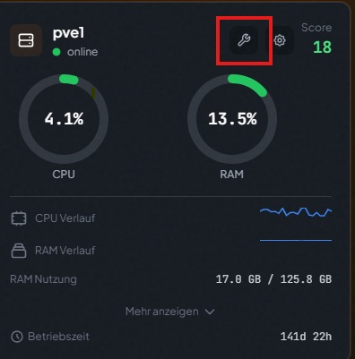

---
layout: default
title: PegaProx 
---

[Home](/) · [Technische Dokumentation](/#technische-dokumentation)


# Einführung
Diese Dokumentation bündelt alle technischen Arbeiten rund um PegaProx im Containerbetrieb.
Beschrieben werden Aufbau, Migration, Betrieb, Wartung und Fehleranalyse der PegaProx-Umgebung auf Proxmox-LXC-Basis.

Ziel ist eine klare, nachvollziehbare Referenz für Installation, Service und Administration, damit sich Systeme reproduzierbar betreiben und im Fehlerfall schnell wiederherstellen lassen.

# Login
## URL
```bash
https://ip-lxc.container:5000
```

## Standardusername und Passwort
Nach der Installation ist der Zugriff mit den werkseitigen Standard-Zugangsdaten möglich.
Diese sind der Herstellerdokumentation bzw. den Installationsunterlagen zu entnehmen.
Das Initialpasswort muss nach dem ersten Login geändert werden.


# Node in Wartung versetzten. 




# Begriffserklärungen
- [Wichtige Begriffe](pegaprox_lxc.html)
